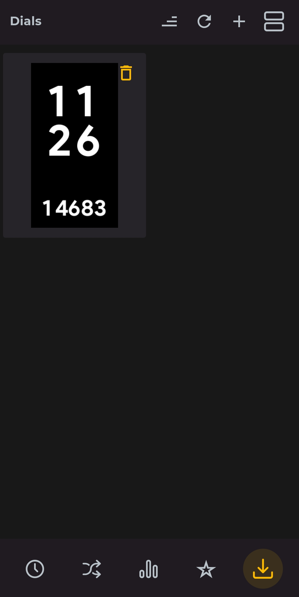

# Install

- download the https://amazfitwatchfaces.com/ app
- install any watchface for your device
- then you will find a new folder on your device /storage/emulated/O/Download/AmazFaces/amazfit-band_Band-7/ and a new subfolder for the downloaded face
- delete the zip and the preview png in that new subfolder
- add your zip and your preview png to that subfolder
- in the amazfit app select the button on the bottom right and upload your face to your band

# Tools

Use https://github.com/melianmiko/zmake to convert graphics

zmake "D:\GIT\BenjaminKobjolke\amazfit_band_7_watchface\watchface" 

